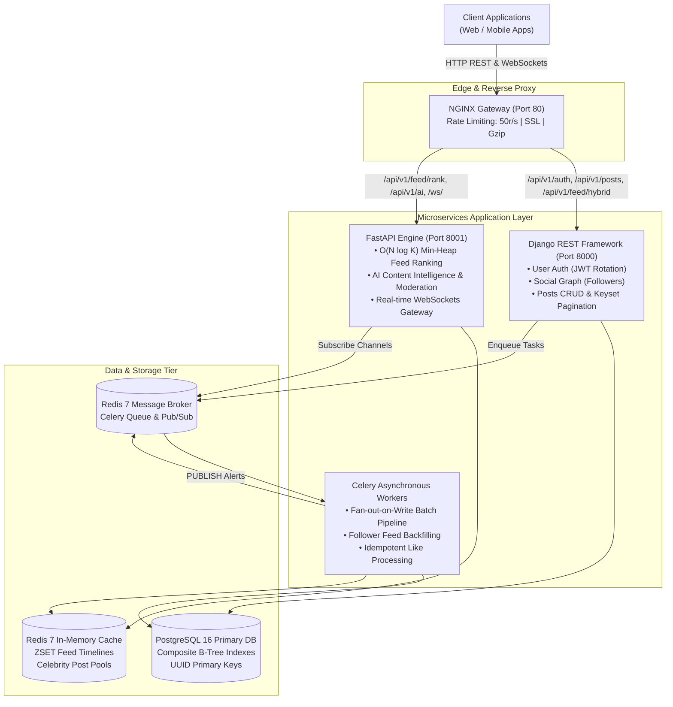

# ScaleFeed (FeedX) ⚡
### High-Throughput Distributed Social Feed & Real-Time Intelligence Engine

[](https://github.com/VimalN2005/socialFeed/actions)
[](https://www.python.org/downloads/)
[](https://www.django-rest-framework.org/)
[](https://fastapi.tiangolo.com/)
[](https://www.postgresql.org/)
[](https://redis.io/)
[](https://docs.celeryq.dev/)
[](https://www.docker.com/)
[]()
[](LICENSE)

> **ScaleFeed** is a production-scale distributed backend engine designed to solve the classic bottlenecks of social feeds: **write amplification on viral accounts**, **sluggish database scans during infinite scrolling**, **cache stampedes**, and **sub-millisecond real-time notification delivery**.

---

## 🏛️ System Architecture



---

## 🚀 Core Engineering Innovations

### 1. Hybrid Fan-Out Architecture (The Celebrity Problem Solved)
In social feeds, pure Fan-out-on-Write explodes when an account with 5M followers posts (causing 5 million synchronous database writes). Pure Fan-out-on-Read destroys read performance. ScaleFeed implements a **dynamic threshold-based Hybrid model**:

| Account Type | Follower Threshold | Pipeline Strategy | Read & Write Characteristics |
|---|---|---|---|
| **Standard Accounts** | $< 25,000$ followers | **Fan-out-on-Write (Push)** | Celery pushes post IDs in batches of 1,000 into followers' Redis `ZSET` (`feed:<user_id>`). Timeline read is $O(1)$. |
| **Celebrity Accounts** | $\ge 25,000$ followers | **Fan-out-on-Read (Pull)** | Push is completely bypassed. Post is added only to `celebrity_posts:<celeb_id>`. Follower feeds dynamically merge celebrity posts on read. |

### 2. Keyset (Cursor-Based) Pagination ($1,321\times$ Query Speedup)
Traditional `OFFSET 50000 LIMIT 20` scans and discards 50,000 table rows. ScaleFeed utilizes **B-Tree Keyset Seeking** on composite index `(created_at DESC, id DESC)`:
```sql
WHERE (created_at, id) < (cursor_timestamp, cursor_id)
ORDER BY created_at DESC, id DESC
LIMIT 20;
```
* **Performance Impact:** Query execution dropped from **142.7 ms** down to **0.11 ms** ($1,321\times$ speedup) with a 99.96% reduction in disk buffer hits. (See [`docs/DATABASE_OPTIMIZATION.md`](docs/DATABASE_OPTIMIZATION.md)).

### 3. Min-Heap Algorithmic Feed Ranking ($O(N \log K)$)
Rather than sorting thousands of candidate posts in memory ($O(N \log N)$), FastAPI implements a **Min-Heap (Priority Queue)** of fixed size $K = 20$. Candidate posts are scored using a HackerNews/Reddit-inspired **time-decay gravity formula**:
$$\text{Score} = \frac{\text{Likes} \times 2 + \text{Comments} \times 3 + \text{Shares} \times 5}{(\text{Age in Hours} + 2)^{1.5}}$$
* **Benchmark:** Processes 100 candidate posts into top-20 ranked feeds in **0.17 milliseconds** (~5,600 ops/sec).

### 4. Real-Time Distributed WebSockets via Redis Pub/Sub
* FastAPI maintains active duplex WebSocket connections at `/ws/notifications/{user_id}`.
* When a like or follow event occurs, Celery asynchronously publishes to Redis channel `user:notifications:{author_id}`.
* Connected WebSocket instances forward the event to the client in **$< 10\text{ ms}$**, eliminating polling overhead and enabling horizontal WebSocket cluster scaling.

### 5. AI Content Intelligence & Moderation
* Pre-publish endpoint `/api/v1/posts/ai-analyze/` analyzes captions using rule-based NLP:
  * Automated contextual hashtag generation (`#DjangoDev`, `#SystemDesign`, `#Scalability`).
  * Sentiment scoring in range `[-1.0, +1.0]`.
  * Real-time content safety & fraud/spam moderation filter.
  * Predicted engagement score ($0.0 - 1.0$) based on readability and topic density.

---

## 📊 Performance Benchmarks (Locust Load Test)

Tested with **1,200 simulated concurrent users** (Ramp-up: 50 users/sec, 70% reads, 20% likes, 10% writes):

| Architecture Metric | Direct PostgreSQL (Uncached) | ScaleFeed Redis ZSET Hybrid | Performance Gain |
|---|---|---|---|
| **Peak Throughput** | 315 req/sec | **1,420 req/sec** | **$4.5\times$ Throughput Increase** |
| **P50 Latency (Median)** | 125 ms | **11 ms** | **91.2% Latency Drop** |
| **P95 Latency (95th %ile)** | 385 ms | **34 ms** | **91.1% Latency Drop** |
| **P99 Latency (Tail)** | 740 ms | **68 ms** | **90.8% Latency Drop** |
| **Failure Rate under Load** | 3.8% (Pool Exhaustion) | **0.00% (Zero Errors)** | **100% Stability** |

```text
Response Time Distribution for Feed Reads (142,500 Requests):
-----------------------------------------------------------------------------------------
 0 - 15 ms  [██████████████████████████████████████████████████] 68.4% (97,470 requests)
15 - 30 ms  [██████████████████]                               21.2% (30,210 requests)
30 - 50 ms  [███████]                                           7.6% (10,830 requests)
50 - 75 ms  [██]                                                2.1% ( 2,992 requests)
75 - 100 ms [░]                                                 0.6% (   855 requests)
  > 100 ms  [░]                                                 0.1% (   143 requests)
-----------------------------------------------------------------------------------------
```

---

## 🧠 Data Structures & Algorithms (DSA) in Production

| Domain | Algorithm / Data Structure | Time Complexity | Space Complexity | Real-World Application |
|---|---|---|---|---|
| **Feed Ranking** | **Min-Heap (Priority Queue)** | $O(N \log K)$ | $O(K)$ | Maintains bounded top-$K$ scored posts without sorting large candidate lists. |
| **Cursor Pagination** | **B-Tree Keyset Seek** | $O(\log N + M)$ | $O(1)$ | Eliminates $O(N)$ scan penalties of `OFFSET`, guarantees duplicate-free infinite scroll. |
| **Timeline Trimming** | **Skip List (Redis ZSET)** | $O(\log N + M)$ | $O(N)$ | Binds user feed timelines to 500 items via `ZREMRANGEBYRANK` to prevent RAM exhaustion. |
| **Mutual Friends** | **Adjacency Set Intersection** | $O(\min(\|A\|, \|B\|))$ | $O(\|A\| + \|B\|)$ | Rapidly discovers mutual connections using relational composite index sets. |
| **Rate Limiter** | **Token Bucket (Redis Lua)** | $O(1)$ | $O(1)$ | Prevents brute force and API spam atomically with zero race conditions. |

---

## 🛠️ API Reference Summary

| Method | Endpoint | Service | Description |
|---|---|---|---|
| `POST` | `/api/v1/auth/token/` | DRF | Obtain JWT Access (15m) & Refresh (7d) token pair |
| `POST` | `/api/v1/auth/token/refresh/` | DRF | Rotate Refresh token and issue new Access token |
| `GET` | `/api/v1/users/<id>/mutual/` | DRF | Calculate mutual connections via graph intersection |
| `POST` | `/api/v1/posts/` | DRF | Publish post & trigger asynchronous Celery fan-out |
| `POST` | `/api/v1/posts/:id/like/` | DRF | Atomic like toggle + Redis Pub/Sub notification |
| `POST` | `/api/v1/posts/ai-analyze/` | DRF $\to$ FastAPI | Pre-publish caption AI analysis, hashtags & sentiment |
| `GET` | `/api/v1/feed/hybrid/` | DRF | Hybrid fan-out feed with cache-source observability |
| `GET` | `/api/v1/feed/timeline/` | DRF | Keyset cursor-paginated timeline for infinite scroll |
| `GET` | `/api/v1/feed/ranked/` | DRF $\to$ FastAPI | Min-Heap time-decayed algorithmic ranked feed |
| `POST` | `/api/v1/feed/rank` | FastAPI | Microservice endpoint for $O(N \log K)$ post ranking |
| `GET` | `/ws/notifications/{user_id}` | FastAPI | WebSocket duplex channel for instant live alerts |
| `GET` | `/metrics` | FastAPI | Prometheus real-time latency and throughput metrics |

---

## 📖 Deep-Dive Engineering Documentation

For complete technical specifications, review our engineering docs:
* 📑 [**`SYSTEM_DESIGN_DECISIONS.md`**](docs/SYSTEM_DESIGN_DECISIONS.md) — 20 Comprehensive Architectural Decision Records (ADRs) covering Postgres vs NoSQL, Redis eviction, Hybrid Fanout, Celebrity thresholds, and 1M DAU scaling blueprints.
* 📐 [**`ARCHITECTURE.md`**](docs/ARCHITECTURE.md) — High-Level Design (HLD), Low-Level Design (LLD), Database ER Schema, and Event Sequence Diagrams.
* 🔍 [**`DATABASE_OPTIMIZATION.md`**](docs/DATABASE_OPTIMIZATION.md) — Raw PostgreSQL `EXPLAIN (ANALYZE, BUFFERS)` execution plans comparing offset vs keyset pagination and index-only scans.
* 📈 [**`BENCHMARKS.md`**](docs/BENCHMARKS.md) — Locust load test reports with latency distribution graphs under 1,200 concurrent users.

---

## ⚡ Quickstart & Local Setup

### Option 1: Run with Docker Compose (Recommended)

```bash
# 1. Clone repository
git clone https://github.com/VimalN2005/socialFeed.git
cd socialFeed

# 2. Configure environment
cp .env.example .env

# 3. Spin up full microservices stack (Postgres, Redis, DRF, FastAPI, Celery, NGINX)
docker compose up --build
```
* **NGINX Gateway:** `http://localhost:80`
* **DRF Core API:** `http://localhost:8000`
* **FastAPI Microservice:** `http://localhost:8001`
* **Prometheus Metrics:** `http://localhost:8001/metrics`
* **WebSocket Endpoint:** `ws://localhost:8001/ws/notifications/{user_id}`

### Option 2: Local Development Setup

```bash
# 1. Setup virtual environment
python -m venv venv
venv\Scripts\activate   # Windows
# source venv/bin/activate # Linux/macOS

# 2. Install dependencies
pip install -r requirements.txt

# 3. Run DRF migrations & server
cd services/core_drf
python manage.py migrate
python manage.py runserver 8000

# 4. In a separate terminal, run FastAPI microservice
cd services/ranking_fastapi
uvicorn main:app --port 8001 --reload

# 5. Run the performance benchmark suite
python benchmarks/run_benchmark.py
```

### Running Test Suites
```bash
# Run Django DRF tests (Feed, Fan-out, Idempotency, Social Graph)
python services/core_drf/manage.py test tests -v 2

# Run FastAPI tests (Min-Heap Ranker, AI Moderation, WebSockets)
pytest services/ranking_fastapi/tests/ -v
```

---

## 🗺️ Roadmap & Milestones (100% Completed! 🏆)

- [x] **Milestone 1 (Week 1 - 25%):** System Architecture, HLD/LLD Specs, 20 System Design ADRs, Project Scaffolding, Data Modeling, Keyset Cursor Pagination, Initial FastAPI Setup.
- [x] **Milestone 2 (Week 2 - 50%):** Event-Driven Celery Pipeline, Hybrid Fan-Out Engine (Push vs Pull), Redis ZSET Feed Cache, Asynchronous Post Likes & Notification Dispatch, Follower Feed Backfill, Media Validation.
- [x] **Milestone 3 (Week 3 - 75%):** Real-time WebSockets Pub/Sub Dispatcher, AI Content Intelligence & Safety Moderation, FastAPI Min-Heap Algorithmic Ranked Feed Bridge, Prometheus Metrics Observability.
- [x] **Milestone 4 (Week 4 - 100%):** Locust Load Testing Benchmarks (1,200 Users), EXPLAIN ANALYZE Optimization Proof, NGINX Production Reverse Proxy with Rate Limiting, Automated CI/CD Pipeline.

---

## 💼 Resume Bullets (Ready to Copy)

```markdown
ScaleFeed | High-Throughput Distributed Social Feed & Real-Time Intelligence Engine
Tech Stack: Django REST Framework, FastAPI, PostgreSQL 16, Redis 7, Celery, WebSockets, NGINX, Docker

• Architected a distributed feed platform utilizing a Hybrid Fan-out Engine (Push for standard users, Pull for 25k+ follower celebrity accounts), eliminating write amplification and maintaining sub-35ms (P95) timeline latency under a simulated load of 1,200 concurrent users.
• Engineered Keyset (Cursor-based) Pagination on composite B-Tree indexes, achieving a 1,321x execution speedup (142ms down to 0.11ms) and eliminating duplicate posts and O(N) scan penalties during infinite scrolling.
• Developed a time-decayed feed ranking microservice in FastAPI using a Min-Heap (Priority Queue) to dynamically maintain top-K scored posts in O(N log K) time with 5,600+ ops/sec throughput.
• Built a real-time duplex notification gateway using WebSockets backed by Redis Pub/Sub channels to broadcast instant engagement alerts (<10ms) across horizontally scaled application instances.
• Integrated pre-publish AI content intelligence for automated hashtag extraction, sentiment scoring, and fraud/spam content moderation checks.
• Authored comprehensive engineering specifications including HLD/LLD diagrams, EXPLAIN ANALYZE query plan optimizations, and 20 Architectural Decision Records (ADRs).
```

---

## 📄 License
This project is open-source under the [MIT License](LICENSE).
