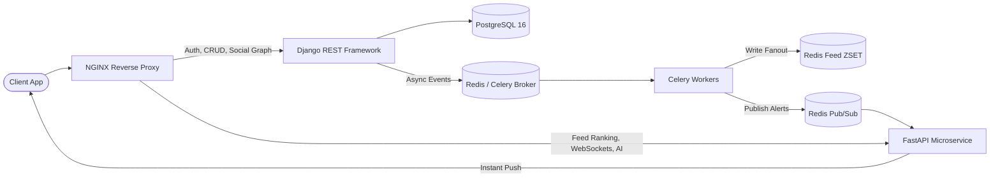

# ScaleFeed (FeedX) ⚡
### High-Throughput Distributed Social Feed Engine

[](https://www.python.org/downloads/)
[](https://www.django-rest-framework.org/)
[](https://fastapi.tiangolo.com/)
[](https://www.postgresql.org/)
[](https://redis.io/)
[](https://www.docker.com/)
[](LICENSE)

> A production-scale, distributed social feed architecture engineered to handle high write-volume, hybrid fan-out pipelines, sub-millisecond timeline caching, and real-time duplex notifications.

---

## 🏛️ System Architecture



---

## 🚀 Key Engineering Highlights

### 1. Hybrid Fan-Out Architecture (The Celebrity Problem Solved)
* **Standard Accounts (< 25k followers):** **Fan-out-on-Write**. New posts are pushed asynchronously via Celery into follower timelines in Redis Sorted Sets (`ZSET`).
* **Celebrity Accounts (≥ 25k followers):** **Fan-out-on-Read**. Avoids write amplification (e.g., millions of writes for a single post). Celebrity posts are merged dynamically into user feeds at read time.

### 2. High-Performance Cursor (Keyset) Pagination
* Replaces sluggish `OFFSET / LIMIT` scans with deterministic B-Tree index seeks:
  ```sql
  WHERE (created_at, id) < (cursor_timestamp, cursor_id)
  ORDER BY created_at DESC, id DESC
  LIMIT 20;
  ```
* Guarantees consistent $O(\log N)$ query times and prevents duplicate or skipped items during infinite scroll.

### 3. Priority Queue Feed Ranking Engine
* Implemented in FastAPI utilizing a **Min-Heap (Priority Queue)** to maintain top-$K$ scored posts based on engagement and time decay:
  $$\text{Score} = \frac{\text{Likes} \times 2 + \text{Comments} \times 3}{(\text{Hours Elapsed} + 2)^{1.5}}$$

### 4. Real-time Duplex Notifications (WebSockets + Redis Pub/Sub)
* Decoupled WebSocket gateway running on FastAPI.
* Horizontally scalable across multiple application instances using Redis Pub/Sub channels (`user:notifications:{user_id}`).

### 5. Production Reliability & Security
* **JWT Authentication:** 15-minute stateless Access Tokens with rotated HTTP-only Refresh Tokens.
* **Rate Limiting:** Token Bucket algorithm implemented in Redis to prevent API abuse.
* **Observability:** Prometheus-compatible `/metrics` endpoint tracking latency, cache hit ratios, and request throughput.

---

## 🧠 Data Structures & Algorithms (DSA) in Production

| Problem Domain | DSA Technique | Computational Complexity |
|---|---|---|
| **Feed Ranking** | Min-Heap / Priority Queue | $O(N \log K)$ |
| **Feed Pagination** | Keyset Seeking on Composite B-Tree Index | $O(\log N + M)$ |
| **Timeline Trimming** | Redis Skip List (`ZREMRANGEBYRANK`) | $O(\log N + M)$ |
| **Mutual Connections** | Graph Adjacency Set Intersection | $O(\min(\|A\|, \|B\|))$ |
| **Rate Limiter** | Token Bucket Algorithm via Redis Lua | $O(1)$ |

---

## 📂 Project Structure

```bash
scaleFeed/
├── docs/
│   ├── ARCHITECTURE.md            # High-Level (HLD) & Low-Level Design (LLD)
│   └── SYSTEM_DESIGN_DECISIONS.md # 20 Comprehensive Architectural Decision Records (ADRs)
├── services/
│   ├── core_drf/                  # Django REST Framework (Auth, Posts, Social Graph)
│   │   ├── apps/
│   │   │   ├── users/             # Custom User, JWT, Social Graph Models
│   │   │   ├── posts/             # Post CRUD, Cursor Pagination, Likes, Comments
│   │   │   └── feed/              # Timeline Generator & Fan-out Dispatcher
│   │   └── config/                # Settings, URL routes, ASGI/WSGI
│   └── ranking_fastapi/           # FastAPI Microservice (Ranking, AI Tags, WebSockets)
│       ├── algorithms/            # Min-Heap Priority Feed Ranking
│       └── routers/               # WebSocket Gateway, AI endpoints, Prometheus metrics
├── benchmarks/
│   └── locustfile.py              # Performance & Load Testing Suite
├── nginx/
│   └── nginx.conf                 # Reverse Proxy & Path-based Microservice Routing
├── docker-compose.yml             # Multi-container orchestration (Postgres, Redis, APIs)
├── requirements.txt
└── README.md
```

---

## ⚡ Quickstart

### Prerequisites
* Python 3.11+
* PostgreSQL 16
* Redis 7

### Local Setup

1. **Clone the repository:**
   ```bash
   git clone https://github.com/your-username/socialFeed.git
   cd socialFeed
   ```

2. **Setup virtual environment & dependencies:**
   ```bash
   python -m venv venv
   # Windows:
   venv\Scripts\activate
   # Linux/macOS:
   source venv/bin/activate

   pip install -r requirements.txt
   ```

3. **Configure Environment:**
   ```bash
   cp .env.example .env
   ```

4. **Run Core DRF Service:**
   ```bash
   cd services/core_drf
   python manage.py migrate
   python manage.py runserver 8000
   ```

5. **Run FastAPI Ranking & WebSocket Microservice:**
   ```bash
   cd services/ranking_fastapi
   uvicorn main:app --port 8001 --reload
   ```

---

## 📊 System Design Deep Dive

For the complete architectural rationales and trade-off analyses, check out:
* 📖 [**System Design Decisions (20 ADRs)**](docs/SYSTEM_DESIGN_DECISIONS.md)
* 📐 [**Architecture & Sequence Diagrams**](docs/ARCHITECTURE.md)

---

## 🗺️ Roadmap & Milestones

- [x] **Milestone 1 (Week 1 - 20%):** Core Architecture, HLD/LLD Specs, 20 System Design ADRs, Project Scaffolding, Data Modeling, Keyset Pagination, FastAPI Ranking Stub.
- [ ] **Milestone 2 (Week 2):** Post & Media CRUD, Follow Graph Optimization, Celery Fan-Out Pipeline.
- [ ] **Milestone 3 (Week 3):** Redis ZSET Timeline Caching, WebSockets Pub/Sub Dispatcher, AI Caption/Hashtags.
- [ ] **Milestone 4 (Week 4):** Locust Load Testing Benchmarks, NGINX Production Proxy, CI/CD Pipeline.

---

## 📄 License
This project is open-source under the [MIT License](LICENSE).
