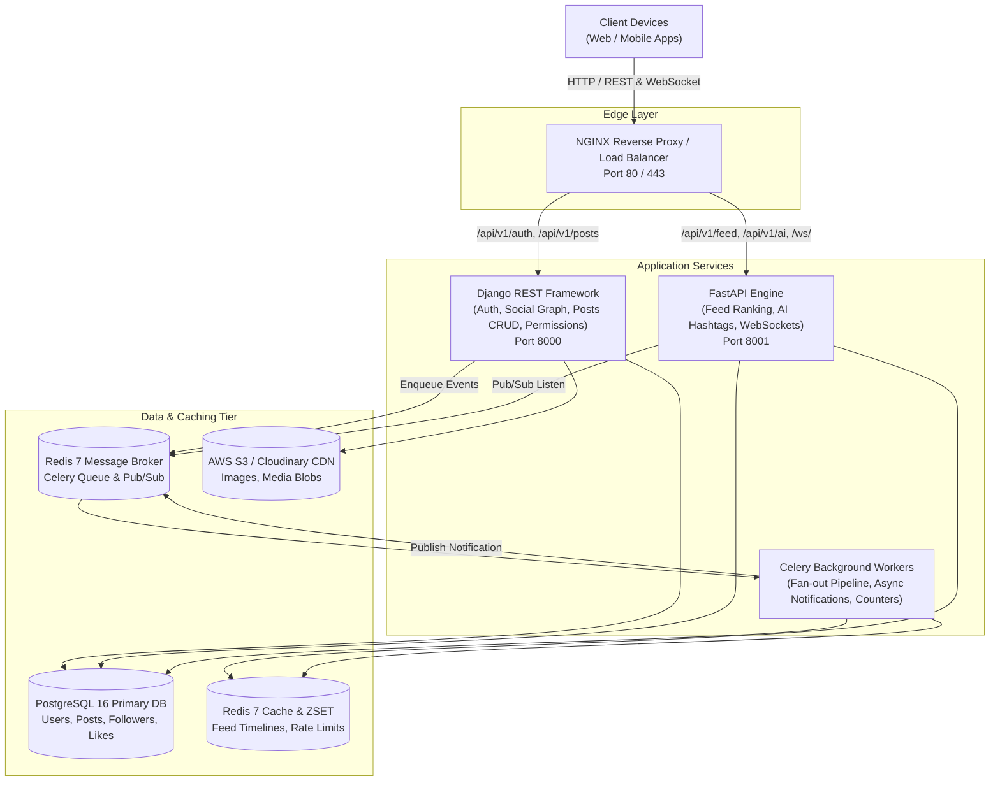
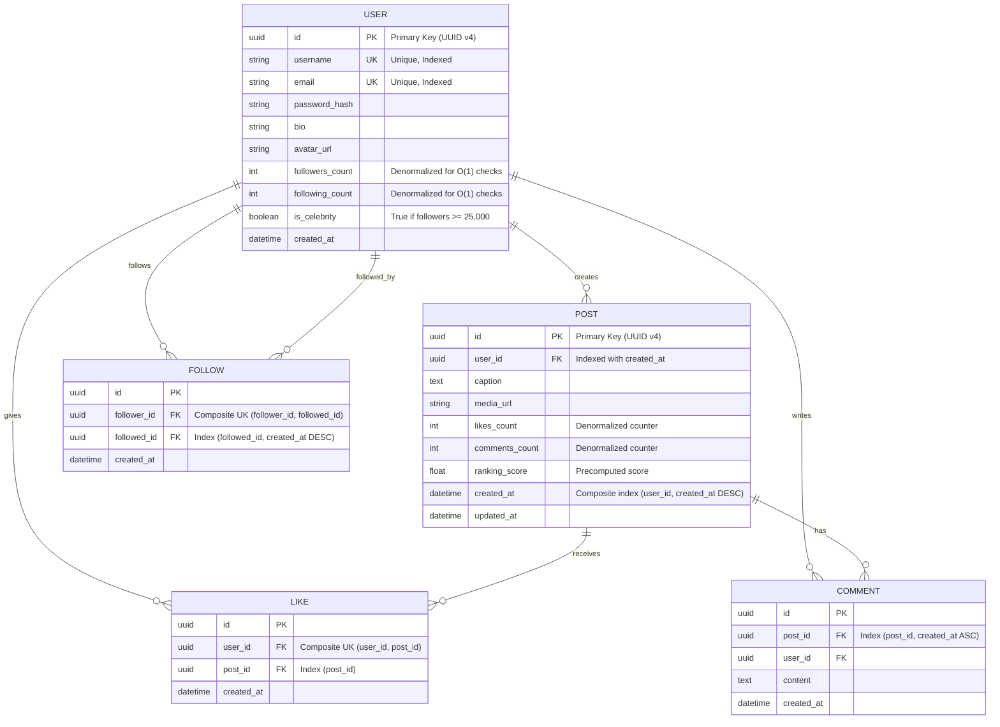
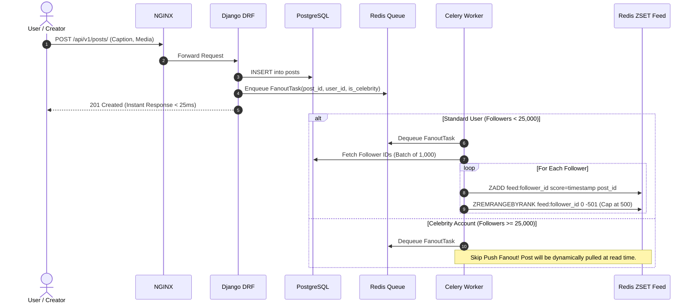
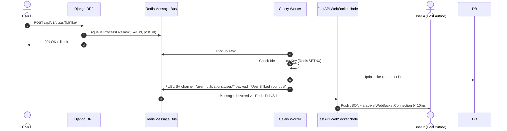

# System Architecture & Technical Specifications

> **Project:** ScaleFeed (FeedX)  
> **Document:** High-Level Design (HLD) & Low-Level Design (LLD)

---

## 1. High-Level Design (HLD)

ScaleFeed is built using a modern decoupled micro-service architecture designed for high read throughput, asynchronous event decoupling, and real-time duplex communication.

---

## 2. Database ER Diagram (LLD)

The data model enforces relational integrity with composite indexes tailored for keyset pagination and social graph lookups.

---

## 3. Event-Driven Sequence Diagrams

### 3.1 Post Creation & Hybrid Fan-out Sequence

### 3.2 Real-time Like & Instant WebSocket Notification

---

## 4. DSA & Algorithmic Complexity in ScaleFeed

| Feature | Data Structure / Algorithm | Time Complexity | Space Complexity | Why it matters |
|---|---|---|---|---|
| **Feed Ranking** | **Min-Heap (Priority Queue)** | $O(N \log K)$ | $O(K)$ | Dynamically ranks top $K$ posts across millions without sorting entire datasets in memory. |
| **Cursor Pagination** | **B-Tree Seek (Keyset Seek)** | $O(\log N + M)$ | $O(1)$ | Eliminates $O(N)$ scan penalties of `OFFSET`, guarantees deterministic infinite scroll without duplicates. |
| **Mutual Friends** | **Adjacency Set Intersection** | $O(\min(|A|, |B|))$ | $O(|A| + |B|)$ | Computes shared social connections rapidly using SQL/in-memory set intersection. |
| **Timeline Trimming** | **Skip List (Redis ZSET)** | $O(\log N + M)$ | $O(N)$ | Keeps active feed sizes bounded (top 500 posts per user) with automatic rank trimming (`ZREMRANGEBYRANK`). |
| **Rate Limiter** | **Token Bucket (Redis Lua)** | $O(1)$ | $O(1)$ | Prevents brute force and API abuse atomically with zero race conditions. |
